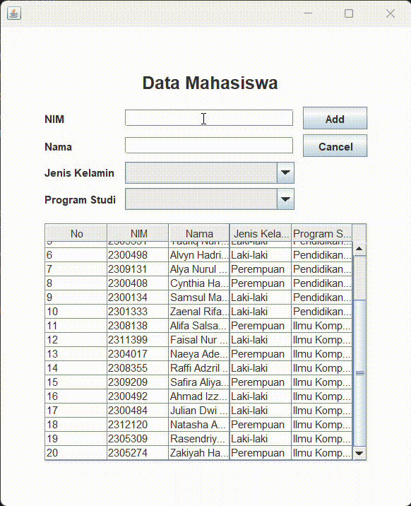

# Janji
Saya Nuansa Bening Aura Jelita dengan NIM 2301410 mengerjakan Tugas Praktikum 5 dalam mata kuliah Desain dan Pemrograman Berorientasi Objek untuk keberkahanNya maka saya tidak melakukan kecurangan seperti yang telah dispesifikasikan. Aamiin.

# Desain Program
Program ini dirancang untuk mengelola data mahasiswa (terkhusus KEMAKOM) dengan antarmuka grafis (GUI) menggunakan Java Swing. 
Program ini memungkinkan pengguna untuk melihat, menambah, memperbarui, dan menghapus data mahasiswa dengan mudah melalui koneksi database.
Program ini terdiri dari 3 kelas utama:

### 1. Mahasiswa (Model Data)
* **Atribut:**
   * `nim` (Nomor Induk Mahasiswa)
   * `nama` (Nama Mahasiswa)
   * `jenisKelamin` (Jenis Kelamin Mahasiswa)
   * `prodi` (Program Studi Mahasiswa)
* **Metode:**
   * Constructor untuk inisialisasi objek
   * Getter & Setter untuk setiap atribut

### 2. Database (Koneksi Database)
* **Atribut:**
   * `connection` (Objek Connection untuk MySQL)
   * `statement` (Objek Statement untuk eksekusi query)
* **Metode:**
   * Constructor untuk membuat koneksi database
   * `selectQuery` untuk mengeksekusi query SELECT
   * `insertUpdateDeleteQuery` untuk mengeksekusi query INSERT, UPDATE, DELETE
   * Getter untuk statement

## Implementasi Database
Program menggunakan database MySQL dengan nama `db_mahasiswa` yang memiliki tabel `mahasiswa` dengan struktur:
* `id` - Primary Key
* `nim` - VARCHAR, harus unik
* `nama` - VARCHAR
* `jenis_kelamin` - VARCHAR
* `prodi` - VARCHAR

### 3. Menu (Antarmuka Pengguna)
* Mewarisi kelas `JFrame`
* **Komponen UI:**
   * `JPanel` sebagai panel utama
   * `JTextField` untuk input nim dan nama
   * `JComboBox` untuk pemilihan jenis kelamin dan program studi
   * `JTable` untuk menampilkan data
   * `JButton` untuk aksi Add/Update, Cancel, dan Delete
   * `JLabel` untuk judul dan label form
* **Variabel Penting:**
   * `selectedIndex` - menyimpan indeks baris yang dipilih di tabel
   * `selectedId` - menyimpan ID mahasiswa yang sedang dipilih
   * `database` - objek Database untuk interaksi dengan database

# Alur Program
### 1. Mulai
* Program membuat koneksi ke database MySQL
* Program membuat jendela aplikasi dan mengambil data mahasiswa dari database untuk ditampilkan dalam tabel

### 2. Menambah Data
* Isi form dengan data mahasiswa baru (NIM, nama, jenis kelamin, dan program studi)
* Tekan tombol "Add"
* Program melakukan validasi yaitu memastikan semua field sudah diisi dan memastikan NIM belum terdaftar di database
* Jika valid, query INSERT dijalankan untuk menambahkan data ke database
* Tabel diperbarui dengan data terbaru dari database

### 3. Mengubah Data
* Klik data di tabel yang ingin diubah
* Form akan terisi otomatis dengan data yang dipilih dari database
* Tombol "Add" berubah menjadi "Update" dan tombol "Delete" muncul
* Ubah data sesuai keinginan
* Tekan tombol "Update"
* Program melakukan validasi bahwa semua field sudah diisi
* Query UPDATE dijalankan untuk memperbarui data di database
* Tabel diperbarui dengan data terbaru dari database

### 4. Menghapus Data
* Klik data di tabel yang ingin dihapus
* Tekan tombol "Delete" yang muncul
* Konfirmasi penghapusan melalui dialog
* Jika pengguna mengkonfirmasi, query DELETE dijalankan untuk menghapus data dari database
* Tabel diperbarui dengan data terbaru dari database

### 5. Membatalkan Input/Edit
* Tekan tombol "Cancel" untuk membersihkan form
* Tombol "Update" kembali menjadi "Add" (jika sedang dalam mode edit)
* Tombol "Delete" disembunyikan

# Dokumentasi

